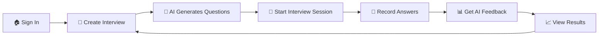

<div align="center">

# 🎯 InterviewPrep

### *AI-Powered Mock Interview Platform*

Practice interviews with personalized questions, real-time feedback, and detailed performance analytics

[](https://nextjs.org/)
[](https://reactjs.org/)
[](https://tailwindcss.com/)
[](https://clerk.com/)

[Features](#-features) • [Tech Stack](#-tech-stack) • [Getting Started](#-getting-started) • [Project Structure](#-project-structure)

</div>

---

## ✨ Features

<table>
<tr>
<td width="50%">

### 🤖 **AI-Powered Questions**
Generate personalized interview questions using Google Gemini AI based on:
- Job role & position
- Required tech stack
- Years of experience

</td>
<td width="50%">

### 🎥 **Real-Time Interview**
Conduct realistic mock interviews with:
- Live webcam integration
- Speech-to-text answer recording
- Voice-enabled question reading

</td>
</tr>
<tr>
<td width="50%">

### 📊 **Smart Feedback System**
Get detailed AI-generated feedback:
- Rating out of 10 for each answer
- Personalized improvement tips
- Comprehensive performance analysis

</td>
<td width="50%">

### 🔐 **Secure & Modern**
Built with modern best practices:
- Clerk authentication
- Protected routes with middleware
- Dark mode support
- Responsive design

</td>
</tr>
</table>

---

## 🛠️ Tech Stack

<details open>
<summary><b>Frontend</b></summary>

| Technology | Version | Purpose |
|------------|---------|---------|
| **Next.js** | 14.2.5 | React framework with App Router |
| **React** | 18.3.1 | UI library |
| **Tailwind CSS** | 3.4.1 | Utility-first styling |
| **shadcn/ui** | Latest | Pre-built component library |
| **Lucide React** | 0.408.0 | Icon library |
| **next-themes** | 0.3.0 | Dark mode support |

</details>

<details open>
<summary><b>Backend & Database</b></summary>

| Technology | Version | Purpose |
|------------|---------|---------|
| **Neon PostgreSQL** | Latest | Serverless database |
| **Drizzle ORM** | 0.32.0 | Type-safe ORM |
| **Clerk** | 5.2.3 | Authentication & user management |

</details>

<details open>
<summary><b>AI & Media</b></summary>

| Technology | Version | Purpose |
|------------|---------|---------|
| **Google Gemini AI** | 0.15.0 | Question & feedback generation |
| **react-webcam** | 7.2.0 | Camera integration |
| **react-hook-speech-to-text** | 0.8.0 | Voice recognition |
| **Web Speech API** | Native | Text-to-speech |

</details>

---

## 🚀 Getting Started

### Prerequisites

- Node.js 18+ installed
- PostgreSQL database (Neon recommended)
- Clerk account for authentication
- Google Gemini API key

### Installation

1️⃣ **Clone the repository**
```bash
git clone https://github.com/david-one8/InterviewPrep.git
cd InterviewPrep
```

2️⃣ **Install dependencies**
```bash
npm install
```

3️⃣ **Environment Setup**

Create a `.env.local` file in the root directory:

```env
# Clerk Authentication
NEXT_PUBLIC_CLERK_PUBLISHABLE_KEY=your_clerk_publishable_key
CLERK_SECRET_KEY=your_clerk_secret_key

# Database (Neon PostgreSQL)
NEXT_PUBLIC_DATABASE_URL=your_neon_database_url

# Google Gemini AI
NEXT_PUBLIC_GEMINI_API_KEY=your_gemini_api_key
```

4️⃣ **Database Setup**

Push the schema to your database:
```bash
npm run db:push
```

5️⃣ **Start Development Server**
```bash
npm run dev
```

Visit [http://localhost:3000](http://localhost:3000) to see the application 🎉

---

## 📝 Available Scripts

| Command | Description |
|---------|-------------|
| `npm run dev` | Start development server at localhost:3000 |
| `npm run build` | Build optimized production bundle |
| `npm start` | Run production server |
| `npm run lint` | Run ESLint for code quality checks |
| `npm run db:push` | Push Drizzle schema to database |
| `npm run db:studio` | Open Drizzle Studio (database GUI) |

---

## 🗂️ Project Structure

```
InterviewPrep/
│
├── 📁 app/
│   ├── 📁 (auth)/              # Authentication routes
│   │   ├── sign-in/            # Sign-in page
│   │   └── sign-up/            # Sign-up page
│   │
│   ├── 📁 dashboard/           # Main application
│   │   ├── 📁 _components/     # Dashboard components
│   │   │   ├── Header.jsx      # Navigation header
│   │   │   ├── NewInterview.jsx        # Interview creation dialog
│   │   │   ├── InterviewList.jsx       # Interview history list
│   │   │   └── InterviewCard.jsx       # Individual interview card
│   │   │
│   │   ├── 📁 interview/[interviewId]/
│   │   │   ├── page.jsx        # Interview details page
│   │   │   ├── 📁 start/       # Live interview session
│   │   │   │   ├── page.jsx
│   │   │   │   └── 📁 _components/
│   │   │   │       ├── QuestionSection.jsx        # Question display
│   │   │   │       └── RecordAnswerSection.jsx    # Answer recording
│   │   │   └── 📁 feedback/
│   │   │       └── page.jsx    # Results & feedback
│   │   │
│   │   ├── how-it-works/       # Documentation page
│   │   ├── upgrade/            # Upgrade page
│   │   ├── layout.jsx          # Dashboard layout
│   │   └── page.jsx            # Dashboard home
│   │
│   ├── layout.js               # Root layout (Clerk Provider)
│   ├── page.js                 # Landing page
│   └── globals.css             # Global styles
│
├── 📁 components/
│   ├── 📁 ui/                  # shadcn/ui components
│   │   ├── button.jsx
│   │   ├── dialog.jsx
│   │   ├── input.jsx
│   │   ├── textarea.jsx
│   │   ├── collapsible.jsx
│   │   └── sonner.jsx
│   ├── ThemeProvider.jsx       # Dark mode provider
│   └── ThemeToggle.jsx         # Theme switcher
│
├── 📁 utils/
│   ├── db.js                   # Database connection
│   ├── schema.js               # Drizzle ORM schema
│   └── GeminiAIModel.js        # Gemini AI configuration
│
├── 📁 drizzle/                 # Database migrations
│   └── meta/                   # Migration metadata
│
├── middleware.js               # Route protection
├── drizzle.config.js           # Drizzle configuration
├── next.config.mjs             # Next.js configuration
├── tailwind.config.js          # Tailwind configuration
└── package.json                # Dependencies
```

---

## 🎯 How It Works

<div align="center">



</div>

### User Journey

1. **🔐 Authentication** - Sign up or sign in using Clerk authentication
2. **📝 Create Interview** - Enter job position, description, and years of experience
3. **🤖 AI Generation** - Gemini AI creates 5 personalized interview questions
4. **🎥 Practice Session** - Answer questions with webcam recording and speech-to-text
5. **📊 Get Feedback** - Receive AI-powered analysis with ratings and improvement tips
6. **📈 Track Progress** - View all past interviews and feedback in your dashboard

---

## 🗄️ Database Schema

**MockInterview Table**
```javascript
{
  id: serial (primary key)
  mockId: varchar (unique identifier)
  jobPosition: varchar
  jobDesc: varchar
  jobExperience: varchar
  jsonMockResp: text (AI-generated questions)
  createdBy: varchar (user email)
  createdAt: varchar
}
```

**UserAnswer Table**
```javascript
{
  id: serial (primary key)
  mockIdRef: varchar (references MockInterview)
  question: varchar
  correctAns: text
  userAns: text
  feedback: text (AI-generated)
  rating: varchar (out of 10)
  userEmail: varchar
  createdAt: varchar
}
```

---

## 🤝 Contributing

Contributions are welcome! Feel free to:

- 🐛 Report bugs
- 💡 Suggest new features
- 🔧 Submit pull requests

---

## �‍💻 Developer

<div align="center">

**Developed by [David](https://github.com/david-one8)**

[](https://github.com/david-one8)

*If you find this project helpful, consider giving it a ⭐ on GitHub!*

</div>

---

## �📄 License

This project is open source and available under the [MIT License](LICENSE).

---

<div align="center">

### *Built with ❤️ for better interview preparation*

**[⬆ Back to Top](#-interviewprep)**

</div>
